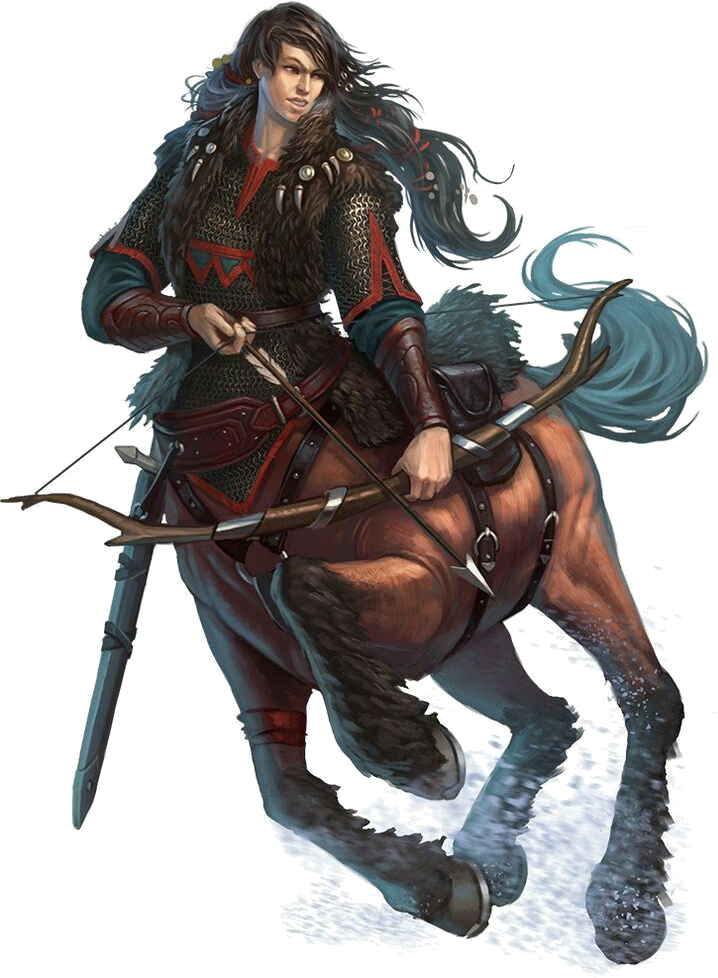
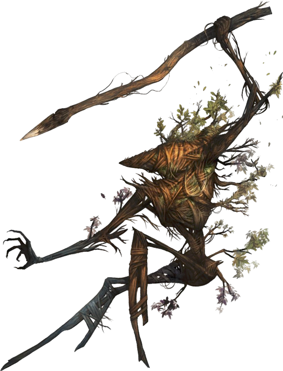

# Die Feenwesen des Finstermondwaldes

Die Gefahr durch den Frostreiter und seine Düstereis-Feenwesen konnte durch den heldenhaften Einsatz der **Grauen Eulen** vom Städtchen Falkengrund abgewendet werden.
Es plagt die **Nymphenkönigin Syntira** allerdings noch immer, dass sie im Kampf gegen die Rodung ihres Reiches durch das Holzfäller-Konsortium in ihrer Verzweiflung auf solch düstere Unterstützung aus den frostigen Hexenlanden Irrisen zurückgreifen musste.
Auch wenn nach der Zerstörung des **Auges der Verzückung** ein Großteil der verdorbenen Feenwesen wieder zurück an ihren Hof gefunden haben, brodelt der Hass noch immer in einigen von ihnen, ganz voran auch in ihrer Schwester **Ambrosia**.

## Der Auftrag der Königin

So ruft Syntira eine Gruppe kleiner Feenwesen zu sich, um gegen die noch immer im **Finstermondwald** umher streunenden Düstereis-Feenwesen zu treten.
Gefahr droht allerdings nicht nur von abtrünnigen Anhängern ihrer Schwester, auch sind die Holzfäller des Konsortiums noch immer mehr als misstrauisch gegenüber sämtlichen Waldbewohnern.
Ausserdem melden Späher, dass im nördlichen Wald, nahe des verlassenen Zwergenklosters **Droskars Schmelztiegel**, eine böse Macht zu spüren ist - selbst nach dem Ableben des Koboldkönigs Merlokrep!

## Kleine Helden

In diesem One-Shot Abenteuer schlüpfen die Spieler in die Rollen von Feenwesen, um im Auftrag ihrer Königin den Finstermondwald zu erkunden.
Es werden vorgefertigte Charaktere mit Challenge Rating 3 (entspricht ungefähr Erfahrungsstufe 4) gestellt, die gut in so ein Setting passen:

* Faun ([de](http://prd.5footstep.de/MonsterhandbuchIII/Faun)/[en](https://www.d20pfsrd.com/bestiary/monster-listings/fey/faun/)) mit 2 Stufen Ranger (Archery Combat Style)
* Spriggan ([de](http://prd.5footstep.de/MonsterhandbuchII/Spriggan)/[en](https://www.d20pfsrd.com/bestiary/monster-listings/humanoids/spriggan/))
* Gnom ([de](http://prd.5footstep.de/NSCKompendium/Grundklassen/Hexenmeister/BefleckterHexenmeister)/[en](https://www.d20pfsrd.com/bestiary/npc-s/npcs-cr-3/tainted-sorcerer-gnome-sorcerer-4/)) mit 4 Stufen Sorcerer (Fey Bloodline)
* [Flitzling](http://prd.5footstep.de/MonsterhandbuchII/Flitzling)/[Quickling](https://www.d20pfsrd.com/bestiary/monster-listings/fey/quickling/)
* [Wurzelmännchen](http://prd.5footstep.de/MonsterhandbuchII/Wurzelmaennchen)/[Twigjack](https://www.d20pfsrd.com/bestiary/monster-listings/fey/twigjack/)
* [Zentaur](http://prd.5footstep.de/Monsterhandbuch/Zentaur)/[Centaur](https://www.d20pfsrd.com/bestiary/monster-listings/monstrous-humanoids/centaur/)
* [Nixe](http://prd.5footstep.de/MonsterhandbuchIII/Nixe)/[Nixie](https://www.d20pfsrd.com/bestiary/monster-listings/fey/nixie/) mit 3 Stufen Druid (Water Domain)
* Gathlain ([de](http://prd.5footstep.de/MonsterhandbuchIV/Gathlain)/[en](https://www.d20pfsrd.com/bestiary/monster-listings/fey/gathlain/)) mit 2 Stufen Fighter, 1 Stufe Cleric (Chaos & Destruction Domain) & 1 Stufe Wizard (Transmutation)

<link rel="stylesheet" href="https://stackpath.bootstrapcdn.com/font-awesome/4.7.0/css/font-awesome.min.css">

    

        
<h3>Faun Ranger</h3>

        

        

            <i class="fa fa-2x fa-thumbs-up" aria-hidden="true"></i>
            <i class="fa fa-2x fa-shield" aria-hidden="true"></i>
            <i class="fa fa-2x fa-bullseye" aria-hidden="true"></i>
            <i class="fa fa-2x fa-gavel" aria-hidden="true"></i>
        

    

    

        
<h3>Centaur</h3>

        

        

            <i class="fa fa-2x fa-thumbs-up" aria-hidden="true"></i>
            <i class="fa fa-2x fa-bullseye" aria-hidden="true"></i>
            <i class="fa fa-2x fa-gavel" aria-hidden="true"></i>
            <i class="fa fa-2x fa-bolt" aria-hidden="true"></i>
        

    

    

        
<h3>Spriggan</h3>

        

        

            <i class="fa fa-2x fa-thumbs-up" aria-hidden="true"></i>
            <i class="fa fa-2x fa-shield" aria-hidden="true"></i>
            <i class="fa fa-2x fa-gavel" aria-hidden="true"></i>
        

    

    

        
<h3>Gnome Sorcerer</h3>

        

        

            <i class="fa fa-2x fa-puzzle-piece" aria-hidden="true"></i>
            <i class="fa fa-2x fa-magic" aria-hidden="true"></i>
        

    

    

        
<h3>Quickling</h3>

        

        

            <i class="fa fa-2x fa-thumbs-up" aria-hidden="true"></i>
            <i class="fa fa-2x fa-shield" aria-hidden="true"></i>
            <i class="fa fa-2x fa-gavel" aria-hidden="true"></i>
            <i class="fa fa-2x fa-bolt" aria-hidden="true"></i>
        

    

    

        
<h3>Twigjack</h3>

        

        

            <i class="fa fa-2x fa-balance-scale" aria-hidden="true"></i>
        

    

    

        
<h3>Nixie</h3>

        

        

            <i class="fa fa-2x fa-puzzle-piece" aria-hidden="true"></i>
            <i class="fa fa-2x fa-magic" aria-hidden="true"></i>
            <i class="fa fa-2x fa-medkit" aria-hidden="true"></i>
        

    

    

        
<h3>Gathlain Fighter / Cleric / Transmuter</h3>

        

        

            <i class="fa fa-2x fa-puzzle-piece" aria-hidden="true"></i>
            <i class="fa fa-2x fa-magic" aria-hidden="true"></i>
            <i class="fa fa-2x fa-medkit" aria-hidden="true"></i>
            <i class="fa fa-2x fa-gavel" aria-hidden="true"></i>
        

    

## Logistik

Das One-Shot Abenteuer wird per Video Chat stattfinden. Dazu bietet sich z.B. die [Jitsi Plattform](https://meet.jit.si/) an, weil sie mit sehr wenig Setup-Aufwand am Rechner, Smartphone oder Tablet einzurichten ist.
Ihr könnt ja schonmal testen, ob ihr einem für den One-Shot dienenden [Chatraum](https://meet.jit.si/SyntirasFeenwesen) betreten könnt :-)

Termin: **TBD!**
