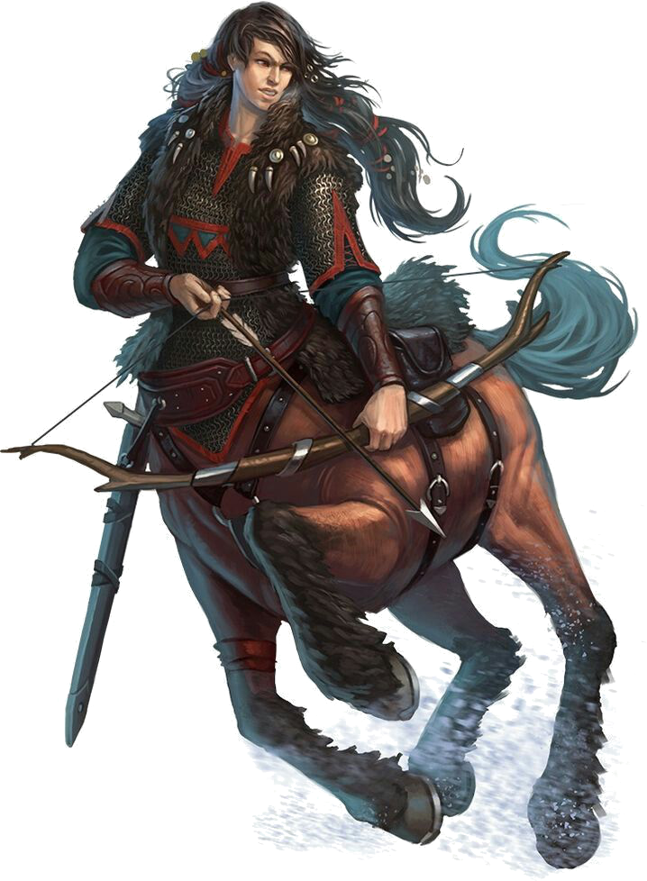

<html>
<head><title>Centaur - created with Hero Lab&reg;</title>
<meta http-equiv="Content-Type" content="text/html; charset=UTF-8"/>
</head>
<body>
<i>This creature has the sun-bronzed upper body of a seasoned warrior and the lower body of a sleek warhorse.</i> 

<b>Centaur</b>&nbsp;&nbsp;&nbsp;&nbsp;CR 3 
<b>XP 800</b> 
Male centaur (<i>Pathfinder RPG Bestiary</i> 42) 
CN Large monstrous humanoid 
<b>Init </b>+6; <b>Senses </b>darkvision 60 ft.; Perception +7 

<b>Defense</b> 

<b>AC </b>17, touch 11, flat-footed 15 (+5 armor, +2 Dex, +1 natural, -1 size) 
<b>hp </b>30 (4d10+8) 
<b>Fort </b>+3, <b>Ref </b>+6, <b>Will </b>+6 

<b>Offense</b> 

<b>Speed </b>50 ft. 
<b>Melee </b>spear +5 (1d8+3/×3) or 
&nbsp;&nbsp;&nbsp;2 hooves +0 (1d6+1) 
<b>Ranged </b>darkwood composite shortbow +6 (1d6+2/×3) 
<b>Space </b>10 ft.; <b>Reach </b>5 ft. 

<b>Statistics</b> 

<b>Str </b>15, <b>Dex </b>14, <b>Con </b>15, <b>Int </b>11, <b>Wis </b>14, <b>Cha </b>12 
<b>Base Atk </b>+4; <b>CMB </b>+7; <b>CMD </b>19 (23 vs. trip) 
<b>Feats </b>Improved Initiative, Run 
<b>Skills </b>Acrobatics +1 (+5 to jump with a running start, +9 to jump), Diplomacy +5, Intimidate +6, Knowledge (nature) +4, Perception +7, Survival +9 
<b>Languages </b>Common, Elven, Sylvan 
<b>SQ </b>undersized weapons 
<b>Combat Gear </b><i>oil of magic weapon</i>, <i>potion of cure light wounds</i> (3), <i>potion of reduce person</i>; <b>Other Gear </b><i>+1 chain shirt</i>, darkwood composite shortbow (+2 Str) with 40 arrows, spear, bedroll, belt pouch, flint and steel, mess kitUE, pot, saddlebags, soap, torch (5), trail rations (3), waterskin 

<b>Ecology</b> 

<b>Environment</b> temperate forests and plains 
<b>Organization</b> solitary, pair, band (3-10), tribe (11-30 plus 3 hunters of 3rd level and 1 leader of 6th level) 
<b>Treasure</b> standard (breastplate, heavy steel shield, longsword,  spear, other treasure) 

<b>Special Abilities</b> 

<b>Darkvision (60 feet)</b> You can see in the dark (black and white only). 
<b>Run</b> Run 5x your speed in light/medium armor or 4x speed in heavy armor and keep Dex when running. 
<b>Undersized Weapons (Ex)</b> The creature uses manufactured weapons as if it were one size category smaller than the creature's actual size. 

Hero Lab and the Hero Lab logo are Registered Trademarks of LWD Technology, Inc. Free download at https://www.wolflair.com
Pathfinder® and associated marks and logos are trademarks of Paizo Inc.®, and are used under license.

</body>
</html>
