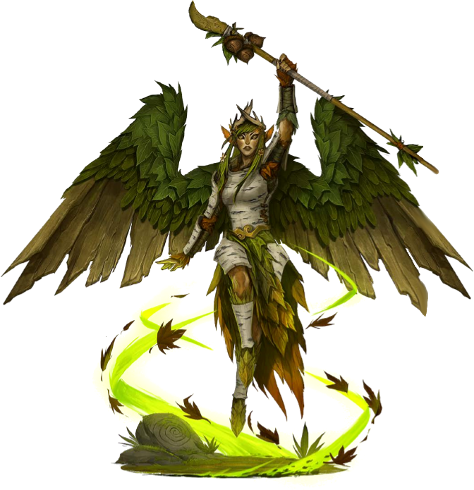

<html>
<head><title>Gathlain Fighter/Cleric/Transmuter - created with Hero Lab&reg;</title>
<meta http-equiv="Content-Type" content="text/html; charset=UTF-8"/>
</head>
<body>
<i>Wings composed of wood and vines grow out of the body of this lithesome fey.</i> 

<b>Gathlain Fighter/Cleric/Transmuter</b>&nbsp;&nbsp;&nbsp;&nbsp;CR 3 
<b>XP 800</b> 
Female gathlain cleric of Gorum 1/fighter 2/transmuter 1 (<i>Ultimate Wilderness</i> 122) 
CN Small fey 
<b>Init </b>+0; <b>Senses </b>low-light vision; Perception +2 

<b>Defense</b> 

<b>AC </b>12, touch 11, flat-footed 12 (+1 natural, +1 size) 
<b>hp </b>29 (4 HD; 1d6+1d8+2d10+6) 
<b>Fort </b>+6, <b>Ref </b>+0, <b>Will </b>+6 (+1 vs. fear) 

<b>Offense</b> 

<b>Speed </b>30 ft., fly 40 ft. (poor) 
<b>Melee </b>dagger +6 (1d3+3/19-20) or 
&nbsp;&nbsp;&nbsp;mwk cold iron glaive +7 (1d8+4/×3) 
<b>Ranged </b>darkwood composite shortbow +4 (1d4+3/×3) 
<b>Space </b>5 ft.; <b>Reach </b>5 ft. (10 ft. with masterwork cold iron glaive) 
<b>Special Attacks </b>channel negative energy 4/day (DC 11, 1d6), destructive smite (+1, 5/day) 
<b>Arcane School Spell-Like Abilities</b> (CL 1st; concentration +2) 
&nbsp;&nbsp;&nbsp;4/day—telekinetic fist (1d4 bludgeoning) 
<b>Domain Spell-Like Abilities</b> (CL 1st; concentration +3) 
&nbsp;&nbsp;&nbsp;5/day—touch of chaos 
<b>Cleric Spells Prepared </b>(CL 1st; concentration +3) 
&nbsp;&nbsp;&nbsp;1st—<i>divine favor</i>, <i>shield of faith</i>, <i>true strike</i>D 
&nbsp;&nbsp;&nbsp;0 (at will)—<i>guidance</i>, <i>resistance</i>, <i>stabilize</i> 
&nbsp;&nbsp;&nbsp;<b>D</b> Domain spell; <b>Domains</b> Chaos, Destruction 
<b>Transmuter Spells Prepared </b>(CL 1st; concentration +2) 
&nbsp;&nbsp;&nbsp;1st—<i>enlarge person</i> (DC 12), <i>mage armor</i>, <i>shield</i> 
&nbsp;&nbsp;&nbsp;0 (at will)—<i>acid splash</i>, <i>mage hand</i>, <i>open/close</i> (DC 11) 
&nbsp;&nbsp;&nbsp;<b>Opposition Schools</b> Illusion, Necromancy 

<b>Statistics</b> 

<b>Str </b>16, <b>Dex </b>10, <b>Con </b>12, <b>Int </b>12, <b>Wis </b>14, <b>Cha </b>12 
<b>Base Atk </b>+2; <b>CMB </b>+4; <b>CMD </b>14 
<b>Feats </b>Arcane Strike, Channel Smite, Flyby Attack, Hover, Scribe Scroll 
<b>Skills </b>Fly +5, Knowledge (arcana) +5, Knowledge (dungeoneering) +5, Knowledge (geography) +5, Knowledge (history) +5, Knowledge (local) +5, Knowledge (nature) +5, Knowledge (planes) +5, Knowledge (religion) +5 
<b>Languages </b>Common, Draconic, Sylvan 
<b>SQ </b>arcane bond (masterwork cold iron glaive), nimbus of vitality, physical enhancement (+1) 
<b>Combat Gear </b><i>pearl of power (1st level)</i>, <i>potion of cat's grace</i>, <i>scroll of cure light wounds</i> (5); <b>Other Gear </b>dagger, darkwood composite shortbow (+3 Str) with 20 arrows, mwk cold iron glaive, backpack, bedroll, belt pouch, candle (10), flint and steel, holy text (Gorum)UE, ink, inkpen, mess kitUE, pot, scroll case, soap, spell component pouch, torch (5), trail rations (2), waterskin, wizard starting spellbook, wooden holy symbol of Gorum 

<b>Ecology</b> 

<b>Environment</b> temperate forests or jungles 
<b>Organization</b> solitary, flight (2-6), or grove (2-12) 
<b>Treasure</b> npc gear (spear, other treasure) 

<b>Special Abilities</b> 

<b>Arcane Bond (Masterwork cold iron glaive) (1/day) (Sp)</b> Use object to cast any spell in your spellbook. Without it, Concentration required to cast spells (DC20 + spell level). 
<b>Arcane Strike</b> As a swift action, add +1 damage, +1 per 5 caster levels and your weapons are treated as magic for the purpose of overcoming damage reduction. 
<b>Channel Smite</b> Channel energy can be delivered through a Smite attack. 
<b>Cleric Channel Negative Energy 1d6 (4/day, DC 11) (Su)</b> Positive energy heals the living and harms the undead; negative has the reverse effect. 
<b>Cleric Domain (Chaos)</b> Granted Powers: Your touch infuses life and weapons with chaos, and you revel in all things anarchic. 
<b>Cleric Domain (Destruction)</b> Granted Powers: You revel in ruin and devastation, and can deliver particularly destructive attacks. 
<b>Destructive Smite +1 (5/day) (Su)</b> Make a melee attack with morale bonus to damage. 
<b>Fly (40 feet, Poor)</b> You can fly! 
<b>Flyby Attack</b> You can take a standard action during your move action while flying. 
<b>Hover</b> Can hover in place without Fly checks, and kick up dust cloud if within 20 ft of ground. 
<b>Illusion</b> You must spend 2 slots to cast spells from the Illusion school. 
<b>Low-Light Vision</b> See twice as far as a human in dim light, distinguishing color and detail. 
<b>Necromancy</b> You must spend 2 slots to cast spells from the Necromancy school. 
<b>Nimbus of Vitality (5 rounds, 1/day)</b> Aura affects you as faerie fire, grants fast healing 2 
<b>Physical Enhancement +1 (Strength) (Su)</b> When preparing spells, chosen physical attribute gains enhancement bonus. 
<b>Telekinetic Fist (1d4 bludgeoning, 4/day) (Sp)</b> As a standard action, ranged touch deals bludgeon dam vs. foe in 30 ft. 
<b>Touch of Chaos (5/day) (Sp)</b> With a melee touch attack, target takes the lower of 2d20 for each d20 roll for 1 round. 
<b>Transmutation</b> Transmuters use magic to change the world around them. 

Hero Lab and the Hero Lab logo are Registered Trademarks of LWD Technology, Inc. Free download at https://www.wolflair.com
Pathfinder® and associated marks and logos are trademarks of Paizo Inc.®, and are used under license.

</body>
</html>
