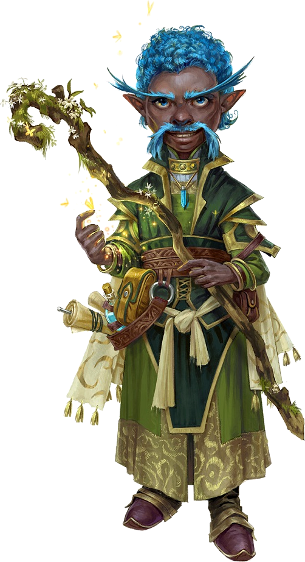

<html>
<head><title>Gnome Sorcerer - created with Hero Lab&reg;</title>
<meta http-equiv="Content-Type" content="text/html; charset=UTF-8"/>
</head>
<body>
<b>Gnome Sorcerer</b>&nbsp;&nbsp;&nbsp;&nbsp;CR 3 
<b>XP 800</b> 
Male gnome sorcerer 4 
CG Small humanoid (gnome) 
<b>Init </b>+0; <b>Senses </b>low-light vision; Perception +3 

<b>Defense</b> 

<b>AC </b>11, touch 11, flat-footed 11 (+1 size) 
<b>hp </b>20 (4d6+4) 
<b>Fort </b>+2, <b>Ref </b>+2, <b>Will </b>+6; +2 vs. illusions 
<b>Defensive Abilities </b>defensive training 

<b>Offense</b> 

<b>Speed </b>20 ft. 
<b>Melee </b>dagger +3 (1d3/19-20) or 
&nbsp;&nbsp;&nbsp;darkwood quarterstaff +4 (1d4) 
<b>Ranged </b>sling +3 (1d3) 
<b>Special Attacks </b>hatred 
<b>Spell-Like Abilities</b> (CL 4th; concentration +8) 
&nbsp;&nbsp;&nbsp;1/day—<i>dancing lights</i>, <i>ghost sound</i> (DC 16), <i>prestidigitation</i>, <i>speak with animals</i> 
<b>Bloodline Spell-Like Abilities</b> (CL 4th; concentration +8) 
&nbsp;&nbsp;&nbsp;7/day—laughing touch 
<b>Sorcerer Spells Known </b>(CL 4th; concentration +8) 
&nbsp;&nbsp;&nbsp;2nd (4/day)—<i>minor image</i> (DC 18) 
&nbsp;&nbsp;&nbsp;1st (7/day)—<i>color spray</i> (DC 17), <i>entangle</i> (DC 15), <i>obscuring mist</i>, <i>sleep</i> (DC 17) 
&nbsp;&nbsp;&nbsp;0 (at will)—<i>daze</i> (DC 16), <i>detect magic</i>, <i>light</i>, <i>mage hand</i>, <i>open/close</i> (DC 14), <i>read magic</i> 
&nbsp;&nbsp;&nbsp;<b>Bloodline</b> Fey 

<b>Statistics</b> 

<b>Str </b>10, <b>Dex </b>10, <b>Con </b>10, <b>Int </b>14, <b>Wis </b>13, <b>Cha </b>18 
<b>Base Atk </b>+2; <b>CMB </b>+1; <b>CMD </b>11 
<b>Feats </b>Effortless Trickery, Eschew Materials, Spell Focus (illusion) 
<b>Skills </b>Acrobatics +0 (-4 to jump), Appraise +6, Craft (mapmaking) +10, Knowledge (arcana) +9, Knowledge (history) +3, Knowledge (nature) +6, Perception +3, Spellcraft +9, Survival +1 (+3 to avoid becoming lost when using a Mapmaker's Kit as you travel), Use Magic Device +11;<b> Racial Modifiers </b>+2 Craft (mapmaking), +2 Perception 
<b>Languages </b>Common, Draconic, Giant, Gnome, Sylvan 
<b>SQ </b>bloodline arcana (+2 DC for compulsion spells), gnome magic, woodland stride 
<b>Combat Gear </b><i>potion of cure light wounds</i>, <i>wand of detect evil (10 charges)</i>, <i>wand of magic missile (CL 3rd, 10 charges)</i>; <b>Other Gear </b>dagger, darkwood quarterstaff, sling with 10 sling bullets, <i>cloak of resistance +1</i>, backpack, bedroll, belt pouch, chalk, flint and steel, ink, inkpen, journalUE, mapmaker's kitAPG, masterwork cartography tools, measuring cord (10 ft.), mess kitUE, paper (5), powderAPG, sack, silk rope (50 ft.), soap, trail rations (3), waterskin 

<b>Special Abilities</b> 

<b>Bloodline Arcana: Fey (Ex)</b> +2 to save DCs from spells of the Compulsion subschool. 
<b>Defensive Training +4</b> Gain a dodge bonus to AC vs. monsters of the Giant subtype. 
<b>Effortless Trickery</b> Maintain concentration on 1 illusion spell per rd as a swift action. 
<b>Eschew Materials</b> Cast spells without materials, if component cost is 1 gp or less. 
<b>Gnome Magic</b> Add 1 to the DCs of any saving throws to resist illusion spells cast. 
<b>Hatred +1</b> Gain a bonus to attack vs. goblinoid/reptilian humanoids. 
<b>Laughing Touch (7/day) (Sp)</b> As a standard action, if melee touch hits, foe can take only move actions for 1 rd. 
<b>Low-Light Vision</b> See twice as far as a human in dim light, distinguishing color and detail. 
<b>Spell Focus (Illusion)</b> Spells from one school of magic have +1 to their save DC. 
<b>Woodland Stride (Ex)</b> Move through undergrowth at normal speed. 

Hero Lab and the Hero Lab logo are Registered Trademarks of LWD Technology, Inc. Free download at https://www.wolflair.com
Pathfinder® and associated marks and logos are trademarks of Paizo Inc.®, and are used under license.

</body>
</html>
