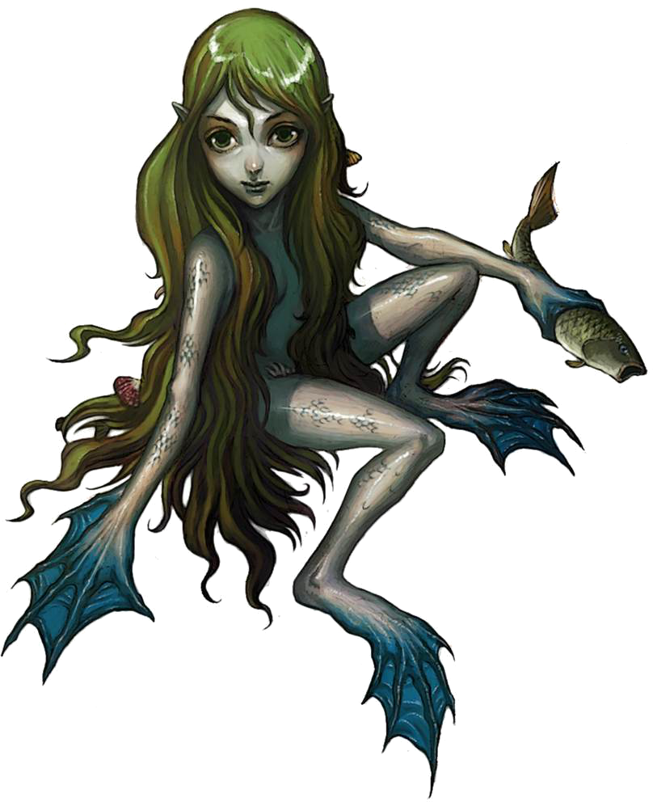

_As it gracefully swims through the water, it becomes clear that this small, green-skinned creature has webbed hands and feet. Its hair is the color of seaweed, and small pearls and shells are wrapped within._  

* * *

**Nixie Druid**    CR 3  
**XP 800**  
Female nixie druid 3 (_Pathfinder RPG Bestiary 3_ 201)  
N Small fey (aquatic)  
**Init** +3; **Senses** low-light vision; Perception +9  

* * *

**Defense**  

* * *

**AC** 15, touch 15, flat-footed 11 (+3 Dex, +1 dodge, +1 size)  
**hp** 28 (5 HD; 2d6+3d8+8)  
**Fort** +4, **Ref** +7, **Will** +7  
**DR** 5/cold iron; **SR** 12  

* * *

**Offense**  

* * *

**Speed** 20 ft., swim 30 ft.  
**Melee** dagger +7 (1d3-2/19-20) or  
   flame +2 touch (1d6+1 fire)  
**Ranged** underwater light crossbow +7 (1d6/19-20)  
**Spell-Like Abilities** (CL 6th; concentration +10)  
   3/day—_charm person_ (DC 15)  
   1/day—_water breathing_  
**Domain Spell-Like Abilities** (CL 3rd; concentration +4)  
   4/day—icicle (1d6+1 cold)  
**Druid Spells Prepared** (CL 3rd; concentration +4)  
   2nd—_fog cloud_D, _resist energy_  
   1st—_entangle_ (DC 12), _hydraulic push_APG, _obscuring mist_D, _produce flame_  
   0 (at will)—_detect poison_, _guidance_, _know direction_, _stabilize_  
   **D** Domain spell; **Domain** Water domain  

* * *

**Statistics**  

* * *

**Str** 7, **Dex** 16, **Con** 13, **Int** 12, **Wis** 13, **Cha** 18  
**Base Atk** +3; **CMB** +0; **CMD** 14  
**Feats** Dodge, Scribe Scroll, Weapon Finesse  
**Skills** Acrobatics +7 (+3 to jump), Bluff +9, Climb +2, Craft (crystal carving) +3, Diplomacy +8, Escape Artist +8, Handle Animal +9, Heal +5, Knowledge (geography) +5, Knowledge (local) +5, Knowledge (nature) +7, Knowledge (religion) +2, Perception +9, Perform (sing) +8, Sense Motive +5, Sleight of Hand +7, Spellcraft +5, Stealth +12, Survival +7, Swim +10, Use Magic Device +8  
**Languages** Aquan, Druidic, Sylvan  
**SQ** amphibious, nature bond (Water domain), nature sense, trackless step, wild empathy +15, woodland stride  
**Combat Gear** _pearl of power (1st level)_, _scroll of barkskin_, _scroll of charm animal_, _scroll of delay poison_, _scroll of ice armor_ (2), _scroll of longstrider_ (2), _scroll of speak with animals_, _wand of bull's strength (9 charges)_, _wand of cure light wounds (20 charges)_; **Other Gear** ice armor, dagger, underwater light crossbowARG with 10 bolts, _goodberry_ (8), backpack, belt pouch, blanketAPG, feed (per day), flint and steel, holly and mistletoe, mess kitUE, pot, scroll case, soap, spell component pouch, torch (5), trail rations (3), waterskin, wooden holy symbol of Hanspur  

* * *

**Ecology**  

* * *

**Environment** temperate aquatic  
**Organization** gang (2-4), band (6-11), tribe (20-80)  
**Treasure** value 200 gp (pearls and shells)  

* * *

**Special Abilities**  

* * *

**Amphibious (Ex)** You can survive indefinitely on land.  
**Damage Reduction (5/cold iron)** You have Damage Reduction against all except Cold Iron attacks.  
**Druid Domain (Water)** Granted Powers: You can manipulate water and mist and ice, conjure creatures of water, and resist cold.  
**Icicle 1d6+1 cold (4/day) (Sp)** As a standard action, ranged touch attack deals cold dam to foe in 30 ft.  
**Low-Light Vision** See twice as far as a human in dim light, distinguishing color and detail.  
**Nature Sense (Ex)** A druid gains a +2 bonus on Knowledge (nature) and Survival checks.  
**Spell Resistance (12)** You have Spell Resistance.  
**Swim (30 feet)** You have a Swim speed.  
**Trackless Step (Ex)** You do not leave a trail as you move through natural surroundings.  
**Wild Empathy +15 (Ex)** Improve the attitude of an animal, as if using Diplomacy.  
**Woodland Stride (Ex)** Move through undergrowth at normal speed.  

Hero Lab and the Hero Lab logo are Registered Trademarks of LWD Technology, Inc. Free download at https://www.wolflair.com Pathfinder® and associated marks and logos are trademarks of Paizo Inc.®, and are used under license.