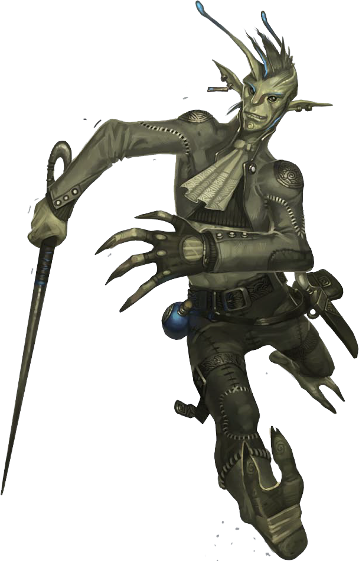

_This creature resembles a short and slight elf wearing drab clothes and a wicked grin. In a blink, the thing darts from sight._  

* * *

**Quickling**    CR 3  
**XP 800**  
Male quickling (_Pathfinder RPG Bestiary 2_ 227)  
CE Small fey  
**Init** +7; **Senses** low-light vision; Perception +9  

* * *

**Defense**  

* * *

**AC** 20, touch 19, flat-footed 12 (+7 Dex, +1 dodge, +1 natural, +1 size)  
**hp** 18 (4d6+4)  
**Fort** +3, **Ref** +12, **Will** +7  
**Defensive Abilities** evasion, natural invisibility, supernatural speed, uncanny dodge; **DR** 5/cold iron  
**Weaknesses** slow susceptibility  

* * *

**Offense**  

* * *

**Speed** 120 ft.  
**Melee** dagger +10 (1d3-1/19-20) or  
   short sword +10 (1d4-1/19-20 plus blue whinnis)  
**Ranged** dart +10 (1d3-1)  
**Special Attacks** sneak attack +1d6  
**Spell-Like Abilities** (CL 4th; concentration +6)  
   1/day—_dancing lights_, _flare_ (DC 12), _levitate_, _shatter_ (DC 14), _ventriloquism_ (DC 13)  

* * *

**Statistics**  

* * *

**Str** 8, **Dex** 24, **Con** 13, **Int** 15, **Wis** 15, **Cha** 14  
**Base Atk** +2; **CMB** +0; **CMD** 18  
**Feats** Dodge, MobilityB, Spring AttackB, Weapon Finesse  
**Skills** Acrobatics +14 (+86 to jump), Bluff +9, Craft (alchemy) +7, Escape Artist +14, Perception +9, Spellcraft +6, Stealth +18 (+58 while still vs. foes who can't see invisible), Survival +4, Use Magic Device +7  
**Languages** Aklo, Common, Sylvan  
**SQ** poison use  
**Combat Gear** _potion of bear's endurance_, _potion of cure light wounds_, black adder venom, blue whinnis (4), caltrops, giant wasp poison, poison, huge scorpion venom; **Other Gear** dagger, dart (6), short sword, _cloak of resistance +1_, backpack, bedroll, belt pouch, chalk (10), flint and steel, grappling hook, hemp rope (50 ft.), mess kitUE, mirror, piton (10), pot, soap, torch (5), trail rations (3), waterskin  

* * *

**Ecology**  

* * *

**Environment** temperate forests  
**Organization** solitary, gang (2-5), or band (4-11 plus one advanced leader)  
**Treasure** npc gear (blue whinnis poison {4 doses}, small short sword, other treasure)  

* * *

**Special Abilities**  

* * *

**Damage Reduction (5/cold iron)** You have Damage Reduction against all except Cold Iron attacks.  
**Evasion (Ex)** If succeed on Reflex save for half dam, take none instead.  
**Low-Light Vision** See twice as far as a human in dim light, distinguishing color and detail.  
**Mobility** +4 to AC vs. AoO provoked by moving out of or through a threatened area.  
**Natural Invisibility (Su)** +40 to stealth when still vs. foes who can't see invisibility.  
**Poison Use (Ex)** You do not risk poisoning yourself accidentally while poisoning a weapon.  
**Slow Susceptibility (Ex)** A quickling that succumbs to a slow effect loses its supernatural speed ability and is sickened as long as the effect persists. This sickened condition persists for 1 round after the slow effect ends.  
**Sneak Attack +1d6** Attacks deal extra dam if flank foe or if foe is flat-footed.  
**Spring Attack** You can move - attack - move when attacking with a melee weapon.  
**Supernatural Speed (Su)** A quickling moves with incredible speed. Save for when it remains motionless (at which point it is invisible), the quickling's shape blurs and shimmers with this speed, granting it concealment (20% miss chance). In addition, this ability grants the q  
**Uncanny Dodge (Ex)** Retain Dex bonus to AC when flat-footed.  

Hero Lab and the Hero Lab logo are Registered Trademarks of LWD Technology, Inc. Free download at https://www.wolflair.com Pathfinder® and associated marks and logos are trademarks of Paizo Inc.®, and are used under license.