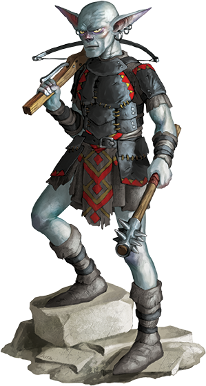

_Flecks of saliva drip from the corners of this filthy and ill-smelling humanoid, and his large pointed ears twitch at every sound._  

* * *

**Spriggan**    CR 3  
**XP 800**  
Male spriggan (_Pathfinder RPG Bestiary 2_ 257)  
CE Large humanoid (gnome)  
**Init** +3; **Senses** low-light vision; Perception +7  

* * *

**Defense**  

* * *

**AC** 17, touch 13, flat-footed 14 (+2 armor, +1 deflection, +3 Dex, +2 shield, -1 size)  
**hp** 34 (4d8+16)  
**Fort** +8, **Ref** +4, **Will** +1  

* * *

**Offense**  

* * *

**Speed** 20 ft.  
**Melee** dagger +7 (1d6+5/19-20) or  
   mwk morningstar +9 (2d6+5)  
**Ranged** light crossbow +5 (2d6/19-20)  
**Space** 10 ft.; **Reach** 10 ft.  

* * *

**Statistics**  

* * *

**Str** 21, **Dex** 17, **Con** 18, **Int** 10, **Wis** 10, **Cha** 9  
**Base Atk** +3; **CMB** +9; **CMD** 23  
**Feats** Combat Reflexes, Weapon Focus (morningstar)  
**Skills** Acrobatics +1 (-3 to jump), Climb +5, Disable Device +8, Perception +7, Sleight of Hand +8, Stealth +4; **Racial Modifiers** +2 Climb, +2 Disable Device, +2 Perception, +2 Sleight of Hand, +2 Stealth  
**Languages** Aklo, Gnome  
**SQ** size alteration, spriggan magic, spriggan skills  
**Other Gear** leather armor, heavy wooden shield, dagger, light crossbow with 10 bolts, mwk morningstar, _ring of protection +1_, backpack, bedroll, belt pouch, flint and steel, hemp rope (50 ft.), mess kitUE, pot, soap, torch (10), trail rations (5), waterskin  

* * *

**Ecology**  

* * *

**Environment** any hills or forests  
**Organization** solitary, pair, or mob (3-12)  
**Treasure** npc gear (leather armor, masterwork morningstar, light crossbow with 10 bolts, other treasure)  

* * *

**Special Abilities**  

* * *

**Combat Reflexes (4 AoO/round)** Can make extra attacks of opportunity/rd, and even when flat-footed.  
**Low-Light Vision** See twice as far as a human in dim light, distinguishing color and detail.  
**Size Alteration (Su)** At will as a standard action, a spriggan can change his size between Small and Large. Weapons, armor, and other objects on the spriggan's person grow proportionally when he changes size (objects revert to normal size 1 round after a spriggan releases  
**Spriggan Magic (Ex)** A spriggan gains a +1 racial bonus on concentration checks and to save DCs for all of its racial spell-like abilities.  
**Spriggan Skills (Ex)** Climb, Disable Device, Perception, Sleight of Hand, and Stealth are class skills for spriggans.  

Hero Lab and the Hero Lab logo are Registered Trademarks of LWD Technology, Inc. Free download at https://www.wolflair.com Pathfinder® and associated marks and logos are trademarks of Paizo Inc.®, and are used under license.